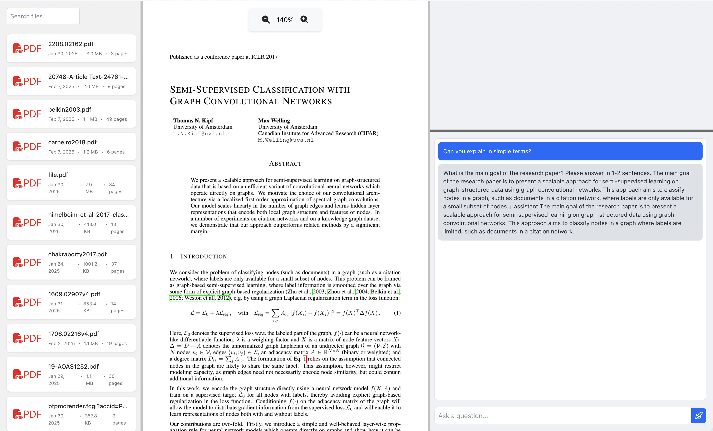

<div align="center">
  <h1>Toolbox.ai</h1>
  <!-- You can add your logo here with: -->
  
</div>

### Overview

Toolbox.ai is an AI reading assistant for research papers. It allows you to select text from uploaded PDF files, ask specific questions about the content, and save answers as notes for later reference. The platform supports various LLMs through Together.ai integration or locally hosted ollama models.
Currently in beta.

[NotebookLM](https://notebooklm.google/) is quite good, but a few reasons why I wouldn't use it.
- Google just wants you to be the source of research articles to be fed to their LLMs, because otherwise its "unethical".
- It doesn't let you select text and ask questions, which I personally needed.

### How it looks
*Ignore the response quality. Used a pretty small model to test the work*




### Setup

```
git clone https://github.com/MinatoNamikaze02
```

#### Frontend 

```
cd toolboxai

npm install && npm start
```

#### Backend

```
cd backend
python -m venv local_env #optional
source local_env/bin/activate #optional
pip install -r requirements.txt

python server.py
```

### Model Configuration
Toolbox.ai supports both Together.ai hosted models and local models through Ollama. Configure your preferred model by setting the following environment variables:

```
# Create a .env file in the backend directory
touch backend/.env
```

```
# Required: Choose your model backend
MODEL_BACKEND=together_ai  # Options: "together_ai" or "local"

# For Together.ai
API_KEY=your_api_key_here
MODEL=model_name  # e.g., "togethercomputer/llama-2-70b-chat"
API_URL=https://api.together.xyz/v1/completions # or other urls

# For local models via Ollama
LOCAL_MODEL_NAME=model_name  # e.g., "llama2" or "mistral"
OLLAMA_API_URL=http://localhost:11434  # Default Ollama API URL

# documents path where your papers are stored
DOCUMENTS_DIR='./documents'
```

#### Together.ai Setup

- Create an account at Together.ai
- Generate an API key from your dashboard
- Set the environment variables as shown above with your API key and preferred model

#### Ollama Setup

- Install Ollama from ollama.ai
- Pull your preferred model: ollama pull llama2 (or another model)
- Start the Ollama server: ollama serve
- Set the environment variables to use your local model

### Feature log
- [ ] Docker support
- [ ] Support follow up questions on notes and general qns.
- [ ] Support Open AI models.
- [ ] Support uploading pdfs.
- [ ] Support scraping pdfs with doi?
- [ ] Support querying on images?
- [ ] UI Refresh?

### Issue log
- [x] Cannot select text from multiple pdf pages
- [x] Cannot delete notes
- [x] Clicking outside before saving note deletes question and context, but retains answer and does not go away until saved
- [x] Right side scroll z-index issues
- [x] cannot ask question on entire pdf
- [ ] "Ask a question" box explodes in size of answer is too long. temporary fix with max tokens

### License
MIT
