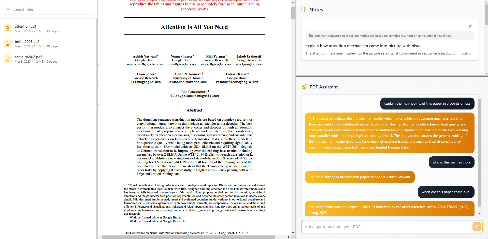

## toolbox.ai

### Overview

Toolbox is a reading assistant for research papers. You can select text from uploaded pdf files and ask specific questions, and save the answers as notes to view later. Still in beta.

## How it looks
pretty simplistic design





## Setup

```
git clone https://github.com/MinatoNamikaze02?tab=repositories
```

### Frontend 

```
cd toolboxai

npm install && npm start
```

### Backend

```
cd backend
python -m venv local_env #optional
source local_env/bin/activate #optional
pip install -r requirements.txt

python server.py
```

