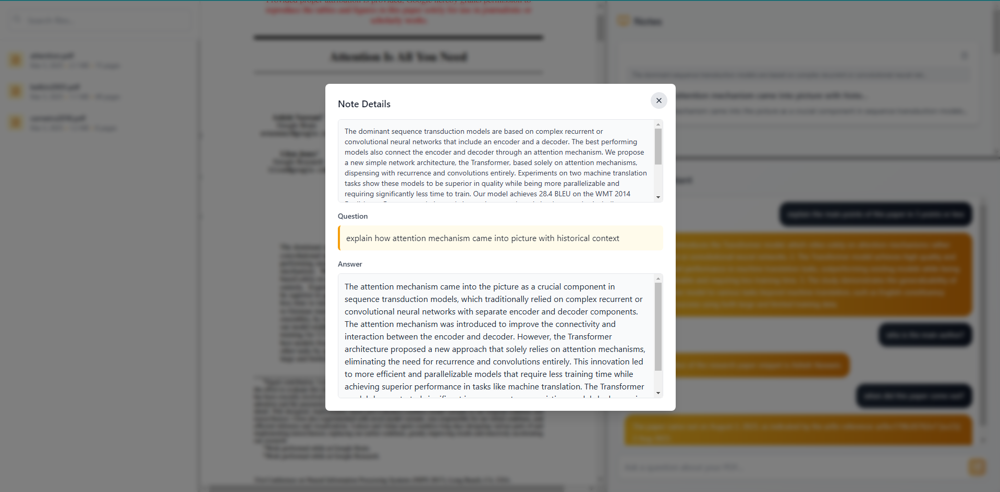

<p align="center">
 
</p>

<h1 align="center">toolbox.ai</h1>

<div align="center">

[]()
[](https://github.com/MinatoNamikaze02/toolboxai/issues)
[](https://github.com/MinatoNamikaze02/toolboxai/pulls)
[](https://github.com/MinatoNamikaze02/toolboxai/blob/main/LICENSE)


</div>

---

<p align="center"> An AI reading assistant for research papers
    <br> 
</p>

## 📝 Table of Contents

- [About](#about)
- [Getting Started](#getting_started)
- [Usage](#usage)
- [Deployment](#deployment)
- [Built Using](#built_using) <!-- [TODO](../TODO.md) - [Contributing](../CONTRIBUTING.md) -->
- [Authors](#authors)
- [Acknowledgments](#acknowledgement)

## 🧐 About <a name = "about"></a>

toolbox.ai is an AI reading assistant for research papers.
It allows you to select text from uploaded PDF files, ask specific questions about the content, and save answers as notes for later reference.
The platform supports various LLMs through Together.ai, OpenAI or locally hosted ollama models.
<br> 
<br> Work in progress...

## 🏁 Getting Started <a name = "getting_started"></a>

These instructions will get you a copy of the project up and running on your local machine for development and testing purposes. See [deployment](#deployment) for notes on how to deploy the project on a live system.

```
git clone https://github.com/MinatoNamikaze02/toolboxai.git
```

#### Frontend 
```
cd toolboxai

npm install && npm start
```

#### Backend
```
cd backend
python -m venv local_env #optional
source local_env/bin/activate #optional
pip install -r requirements.txt

python server.py
```

### Model Configuration
toolboxAi supports [together.ai](https://api.together.ai/models), [openai](https://platform.openai.com/docs/models) hosted models and local models through [ollama](https://ollama.com/library). Configure your preferred model by setting the following environment variables:

```
# Create a .env file in the backend directory
touch backend/.env
```

```
# Required: Choose your model backend
MODEL_BACKEND=together_ai  # Options: "togetherai", "openai" or "local"

# For Together.ai
API_KEY=your_api_key_here
MODEL=model_name  # e.g., "togethercomputer/llama-2-70b-chat"
API_URL=https://api.together.xyz/v1/completions # or other urls

# For local models via Ollama
LOCAL_MODEL_NAME=model_name  # e.g., "llama2" or "mistral"
OLLAMA_API_URL=http://localhost:11434  # Default Ollama API URL

# documents path where your papers are stored
DOCUMENTS_DIR='./documents'
```
## 🎈 Usage <a name="usage"></a>


HomePage


Select the text you want to know more about


Ask questions about the texts


You can save the responses as notes as well

## 🚀 Deployment <a name = "deployment"></a>

(idk if this is required, just in case))

## ⛏️ Built Using <a name = "built_using"></a>

- [ReactJS](https://react.dev/) - JavaScript Library for Building User Interfaces  
- [Python](https://www.python.org/) - Programming Language  
- [TogetherAI](https://www.together.ai/) - AI Model Hosting and API Platform  


## ✍️ Authors <a name = "authors"></a>

- [@MinatoNamikaze02](https://github.com/MinatoNamikaze02/) - Idea & Initial work
- [@pranavrajendran18](https://github.com/pranavrajendran18) - Collaborator


## 🎉 Acknowledgements <a name = "acknowledgement"></a>

MIT License