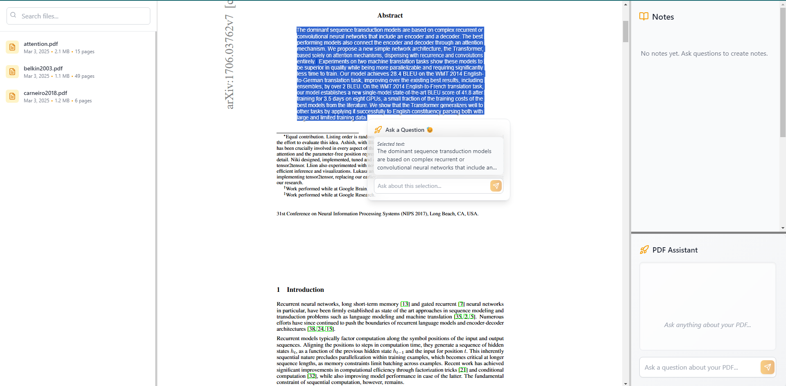

<div align="center">
  <h1>toolboxAi</h1>
  <!-- You can add your logo here with: -->
  
</div>

### Overview

toolboxAi is an AI reading assistant for research papers. It allows you to select text from uploaded PDF files, ask specific questions about the content, and save answers as notes for later reference. The platform supports various LLMs through Together.ai, OpenAI or locally hosted ollama models. Work in progress.

### How it looks





### Setup

```
git clone [https://github.com/MinatoNamikaze02](https://github.com/MinatoNamikaze02/toolboxai)
```

#### Frontend 
```
cd toolboxai

npm install && npm start
```

#### Backend
```
cd backend
python -m venv local_env #optional
source local_env/bin/activate #optional
pip install -r requirements.txt

python server.py
```

### Model Configuration
toolboxAi supports [together.ai](https://api.together.ai/models), [openai](https://platform.openai.com/docs/models) hosted models and local models through [ollama](https://ollama.com/library). Configure your preferred model by setting the following environment variables:

```
# Create a .env file in the backend directory
touch backend/.env
```

```
# Required: Choose your model backend
MODEL_BACKEND=together_ai  # Options: "togetherai", "openai" or "local"

# For Together.ai
API_KEY=your_api_key_here
MODEL=model_name  # e.g., "togethercomputer/llama-2-70b-chat"
API_URL=https://api.together.xyz/v1/completions # or other urls

# For local models via Ollama
LOCAL_MODEL_NAME=model_name  # e.g., "llama2" or "mistral"
OLLAMA_API_URL=http://localhost:11434  # Default Ollama API URL

# documents path where your papers are stored
DOCUMENTS_DIR='./documents'
```

### Feature log
- [x] Select text and ask questions.
- [x] Ask general questions on the entire pdf.
- [x] Save notes for each pdf in [localstorage](https://developer.mozilla.org/en-US/docs/Web/API/Window/localStorage).
- [x] Select text across different pages of a pdf.
- [x] View notes on focus mode with context, question and answer highlighted.
- [x] Delete notes and clear conversation any time.
- [x] Pdf viewer and zoom.
- [ ] Docker support
- [ ] Support follow up questions on notes.
- [ ] Support uploading pdfs.
- [ ] Support scraping pdfs with doi?
- [ ] Support querying on images

### Issue log
- [x] Cannot select text from multiple pdf pages
- [x] Cannot delete notes
- [x] Clicking outside before saving note deletes question and context, but retains answer and does not go away until saved
- [x] Right side scroll z-index issues
- [x] cannot ask question on entire pdf
- [ ] "Ask a question" box explodes in size of answer is too long. temporary fix with max tokens

### License
MIT
